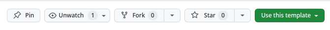

# Butterfly
This is a **template repository** for using the 'blue-yonder' package. In order to create a repository with this template in your account or the account of your organization just click the 'Use this template' button on the top of this page and fill all the necessary information about ownership of the repository. The copy of this repo will appear in your account where you will be able to use and modify it the way you want.

<br>The `blue-yonder` package is a pypi Python package that allows you to program your own automation of simple tasks on BlueSky network using Python. It can also be your door to the brave new world of AI, because it can serve as a connector between your Language Models and your social presence account on BlueSky if you know Python and can write programs that you need.

#### Installation of 'blue-yonder' package
To install the `blue-yonder` package from pypi.org, run the following command in your terminal:
```Bash
pip install blue-yonder 
```

#### Usage
To use the `blue-yonder` package, import it in your Python code:
```Python
from blue_yonder import Actor, Another, yonder
```
Notice that the name of the library that you are using is `blue_yonder`, with an underscore.
<br>There are more 'playful' aliases for the `blue_yonder` Client too; namely:
```Python
from blue_yonder import Butterfly, Flower
```
This is because Butterflies are the main 'clients' of the blue sky of course... and they interact with Flowers.

After using this template repository to create your own repository in your account, clone it to your computer and create a git excluded file .env using a .env_example format; use it to set the environment variables. As an alternative you can use git excluded config.yaml file formatted as it is shown in config_example.yaml file and go_configure function in a py file next to it.

#### Examples
The BlueSky service uses sessions and tokens associated with your account that let you make changes in the environment of the BlueSky. While authorized you can post text or images, change the preferences of your account and perform many other actions that suits you best.

In browser all the necessary credentials are (automatically) stored in cookies of your browser, but if you are building your own automation you need to take care of all that youself, otherwise the 'log-in' service of BlueSky would be overwhelmed by repeated log-in attempts, and we don't want that to happen. That is why the very first example is:
#### [1. How to save a session](./how_to_save_session.py)
This mechanism will help the service to avoid overloads and save you 'limits'.
#### [2. How to post text](./post_text.py)
This is a most basic example of a plain text post that will be on your profile. If you want to post a reply to somebody's post - see the 5-th example.
#### [3. How to post a quote](./post_quote.py)
This is an example of a plain text post quoting another post.
#### [4. Post text and embed an image](./post_embed_image.py)
This is an example of a text (which can be an empty string) post with an embedded image.
#### [5. Post text and a link to external page](./post_embed_external.py)
This is a most basic example of a plain text post.
#### [6. How to post a reply to a post](./post_reply.py)
This is what you need to do to reply to a post that you found in the BlueSky web-application.